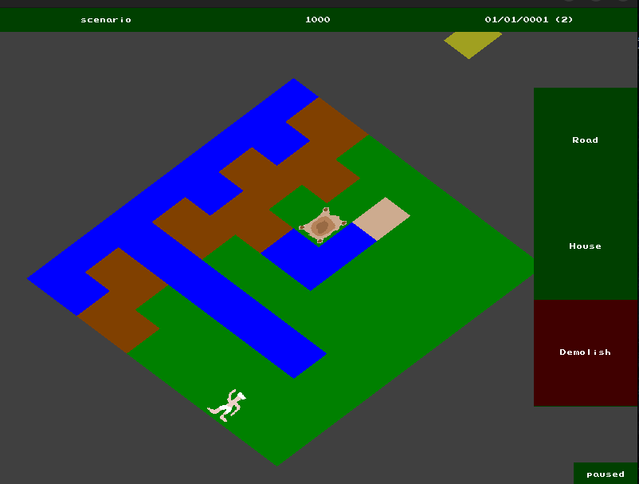

# pharaoh

Reimplementation of the famous city-building game by [Sierra](https://en.wikipedia.org/wiki/Pharaoh_(video_game)). Inspiration taken from this repo [Banderi/Ozymandias](https://github.com/Banderi/Ozymandias).

# Installation

## Prerequisite

This projects uses:
* [google test](https://github.com/google/googletest): installation instructions [here](https://www.eriksmistad.no/getting-started-with-google-test-on-ubuntu/), a simple `apt-get` should be enough.
* `cmake`: installation instructions [here](https://askubuntu.com/questions/355565/how-do-i-install-the-latest-version-of-cmake-from-the-command-line), a simple `apt-get` should also be enough.
* [eigen](https://eigen.tuxfamily.org/index.php?title=Main_Page): installation instructions [here](https://www.cyberithub.com/how-to-install-eigen3-on-ubuntu-20-04-lts-focal-fossa/) for Ubuntu 20.04, a simple `sudo apt install libeigen3-dev` should be enough.

## Instructions

* Clone the repo: `git clone git@github.com:Knoblauchpilze/pge-app.git`.
* Clone dependencies:
    * [core_utils](https://github.com/Knoblauchpilze/core_utils)
    * [maths_utils](https://github.com/Knoblauchpilze/maths_utils)
* Go to the project's directory `cd ~/path/to/the/repo`.
* Compile: `make run`.

Don't forget to add `/usr/local/lib` to your `LD_LIBRARY_PATH` to be able to load shared libraries at runtime. This is handled automatically when using the `make run` target (which internally uses the [run.sh](data/run.sh) script).

# The game

This is how the game currently looks like:

## What's done

We have the concept of a map, containing tiles, buildings and citizens. We also have the concept of a scenario which regroups a map, an amount of gold and a time manager.

The app is able to simulate the passage of time in the scenario which in turns simulates the buildings and the citizens already existing in the game. This happens in the [scenario](src/lib/game/core/Scenario.cc#L41). Each tick is attached a [service](src/lib/game/core/services/Service.hh) which is an abstract class tasked with simulating an aspect of the game. For now, a single service is attached to the creation of [settlers](src/lib/game/core/services/Migrants.cc#L16).

The main driver of change are the buildings which can spawn new citizens during the simulation step. The citizens in turn are taking actions and disappearing when it's done.

The user is able to create new buildings in the map and this deduce some money from the balance of the scenario. They can also demolish buildings, which in turn will kill citizens attached to the building.

The citizens are able to find their way in the map avoiding obstructed cells and are moving once per turn. We reused the [AStar](https://github.com/Knoblauchpilze/cellify/tree/master/src/game/motion) algorithm defined for the [cellify](https://github.com/KnoblauchPilze/cellify) project The simulation mechanism relies on an abstract class called [Runner](src/lib/game/core/services/citizens/Runner.hh) which is responsible to make the citizens of a certain type to evolve.
